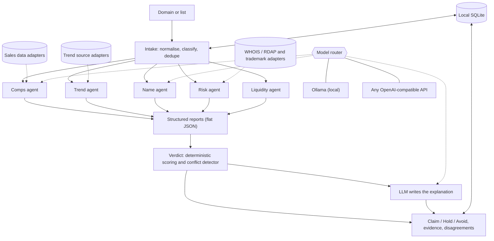

# Quoin

> *Six small minds argue over every domain before you spend a renewal fee.*

**Status: concept and research stage. Nothing below is built yet. Sections marked "planned" describe the intended product.**

---

## The abstract

A quoin is a cornerstone: the wedge of stone that holds a corner of a wall true. It also sounds like *coin*, which is the point.

Every domain investor has stood at the edge of the register button with a gut feeling and three browser tabs open. One appraiser says $400. Another says $14,000. A forum post from 2019 says "it'll sell." Meanwhile the renewal clock is already ticking.

Quoin replaces the gut feeling with a small, argumentative staff. One agent hunts for comparable sales. One reads the heat of a sector. One judges the name out loud. One looks for trouble. One asks the unromantic question: *will this sell before it bleeds me dry?* A final agent weighs the reports and answers in three words, **Claim, Hold, or Avoid**, with every receipt attached and every disagreement left visible.

It runs on whatever brain you give it: a local model through Ollama, or any API that speaks the OpenAI format. Your portfolio, your notes and your research stay on your machine.

It advises. It never buys, bids or negotiates for you.

---

## The manifesto

1. **Advice, never autopilot.** The tool does not spend your money. You do.
2. **No number without receipts.** If Quoin shows a price range, it shows the sales behind it. If it cannot find comparables, it says so instead of inventing them.
3. **"I don't know" is an answer.** Most new TLDs and novel names have thin market data. Quoin flags low confidence instead of faking precision.
4. **Rank, don't pretend.** No appraisal system predicts exact sale prices. Quoin leads with ranking, score and probability, not a dollar figure to the nearest dollar.
5. **Disagreement is information.** When Trend says "hot" and Comps finds nothing similar, that conflict is the most useful thing on the screen.
6. **Your data stays home.** Local-first, bring-your-own-model, no account required.

---

## The staff (planned features, each with a motto)

### The agents

| Feature | Motto | What it does |
|---|---|---|
| **Comps Agent** | *Receipts or silence.* | Finds comparable past sales and shows each one. Returns "no comparable found" when it finds none. |
| **Comp Classifier** | *Like with like.* | Sorts a domain into a class (short brandable, two-word .com, .ai keyword, and so on) before comparing, so a premium name is never judged against junk. |
| **Trend Agent** | *Heat, not hype.* | Reads sector and keyword momentum from pluggable sources and reports a trend signal with a confidence level. |
| **Name Agent** | *Say it out loud.* | Scores length, pronounceability, memorability, brandability and TLD fit, with plain-language reasons. |
| **Risk Agent** | *Due diligence before dopamine.* | Checks trademark exposure, WHOIS age and ownership history, and spam or blacklist signals. |
| **Liquidity Agent** | *Will it sell before it bleeds?* | Estimates time-to-sell and the likely buyer type, then weighs it against renewal cost. |
| **Verdict Agent** | *Claim, Hold, Avoid, with the reasons attached.* | Weighs the five reports into a verdict, a confidence level and a price band. |

### The desk

| Feature | Motto | What it does |
|---|---|---|
| **Disagreement View** | *Where the minds split.* | Highlights conflicts between agents instead of averaging them away. |
| **Evidence Panel** | *Every score has a source.* | Click any score to see the data, comps and reasoning behind it. |
| **Model Switcher** | *Bring your own brain.* | Choose a local model or an API per agent: a small local model for naming, a stronger one for the verdict. |
| **Portfolio Ledger** | *Know your carrying cost.* | Tracks buy price, renewal dates and asking price in a local database. |
| **Cost Tracker** | *Profit is what's left after the renewals.* | Computes net result per name after acquisition, renewals, fees and holding time. |
| **Backtest Mode** | *Grade your own homework.* | Re-scores your past purchases and shows how often the staff would have been right. |
| **Drop Scanner** | *Wake up to a shortlist.* | Pre-scores newly available or expiring names against your criteria. |
| **Watchlists and Alerts** | *Tell me when the weather changes.* | Notifies you when a watched name's signals shift. |
| **Plug-in Sources** | *Sources are plugins.* | Every data source is a swappable adapter, so no single provider can break the tool. |
| **Draft-only Outreach** | *Drafts, never sends.* | Writes a listing page or inquiry draft for you to review and send yourself. |

---

## Architecture (planned)

### The big picture



Solid arrows are the main flow. Dotted arrows are swappable dependencies.

### The layers

| Layer | Job | Swappable? |
|---|---|---|
| **Intake** | Cleans the domain, assigns it a class (short brandable, two-word .com, .ai keyword...), removes duplicates | Rules are editable |
| **Agents** | Five specialists, each answering one question | Yes, each can be disabled or replaced |
| **Adapters** | Fetch outside data (sales, trends, WHOIS/RDAP, trademark, zone files) | Yes, one adapter per source |
| **Model router** | Sends each agent's LLM calls to a local model or an API | Yes, per agent |
| **Verdict** | Turns the five reports into a decision using fixed, logged rules | Weights are configurable |
| **Store** | Keeps domains, reports, verdicts, ledger and cached evidence locally | SQLite file you own |

### The agent contract

Every agent receives the same input and must return the same flat shape. Flat schemas matter because small local models are more reliable with simple JSON than with deeply nested structures.

```json
{
  "agent": "comps",
  "signal": "strong | weak | none | unavailable",
  "confidence": 0.0,
  "evidence": [
    { "source": "adapter name", "ref": "sale record or URL", "note": "why it counts" }
  ],
  "missing": ["what the agent could not find"],
  "summary": "one or two plain sentences"
}
```

Two rules are enforced in code, not in the prompt:
1. A report with an empty `evidence` list cannot claim a `strong` or `weak` signal. It must return `none`.
2. If an adapter fails, the agent returns `unavailable`. It never falls back to guessing.

### How the verdict is made

1. **Score.** Fixed rules combine the five reports into a score and a confidence level. Weights live in a config file you can edit.
2. **Detect conflicts.** If two agents point in opposite directions (for example Trend says hot while Comps finds nothing similar), the conflict is flagged and shown, not averaged away.
3. **Explain.** Only now does an LLM write the plain-language explanation, using the structured reports as its only input.
4. **Log.** Inputs, reports, weights and output are stored together, so Backtest Mode can replay any past decision exactly.

This keeps the model away from the number. The documented failure of other AI appraisers is invented comps and answers that change from run to run, and deterministic scoring addresses both.

### Model routing (planned config)

```yaml
models:
  default:
    provider: ollama
    base_url: http://localhost:11434/v1
    model: <a local model that supports structured output>

  agents:
    name:
      use: default
    verdict_explainer:
      provider: openai-compatible
      base_url: <your api url>
      model: <your model>
      api_key_env: QUOIN_API_KEY
```

Every provider is reached through the OpenAI-style chat format, so adding one means adding a block, not writing code. Keys are read from environment variables and never stored in the database.

### Data adapters

Each adapter implements the same small interface: given a domain, return records that carry a source, a date, and a licence note. Adapters planned for v1 and v1.5:

| Adapter | Used by | Notes |
|---|---|---|
| Sales (user-supplied export, optional paid API) | Comps, Liquidity | Check each provider's terms first |
| Zone-file growth (ICANN CZDS) | Trend, Drop Scanner | Needs approval per registry |
| Google Trends (optional) | Trend | Official API is alpha-only, so this is best-effort |
| WHOIS / RDAP | Risk | Age and ownership history |
| Trademark search | Risk | A warning flag, not legal advice |

### Storage

One local SQLite file with tables for `domains`, `reports`, `verdicts`, `ledger` and `evidence_cache`. Nothing is uploaded anywhere.

### Planned repo layout

```
quoin/
├── intake/            normalise, classify, dedupe
├── agents/
│   ├── comps.py
│   ├── trend.py
│   ├── name.py
│   ├── risk.py
│   └── liquidity.py
├── verdict/
│   ├── scoring.py     deterministic rules
│   ├── conflicts.py   disagreement detector
│   └── explain.py     LLM explanation only
├── adapters/
│   ├── sales/
│   ├── trends/
│   ├── whois/
│   ├── trademark/
│   └── zonefiles/
├── models/
│   └── router.py      local or API, per agent
├── store/
│   └── db.py
├── config/
│   ├── models.yaml
│   └── weights.yaml
└── cli.py
```

### Design decisions, and why

- **Deterministic score, LLM explanation.** Keeps results reproducible and keeps the model from inventing numbers.
- **Fail loudly.** A missing data source shows up as `unavailable` in the report, never as a quiet guess.
- **Sources as plugins.** Data access is the biggest risk in this project, so no single provider should be able to break it.
- **Local first.** Your portfolio and research never leave your machine unless you choose an API model.
- **No buying path in the code.** The tool holds no registrar write credentials, so it cannot purchase, bid or negotiate even by mistake.

---

## Feasibility (as of October 2026)

Status key: **Works** (as planned), **Change** (needs a different approach), **Unproven** (could not verify).

| Area | Status | What the research found |
|---|---|---|
| Local or API models via one interface | **Works** | Ollama serves an OpenAI-compatible endpoint, so switching is mostly a base-URL change. It has no built-in authentication, so don't expose it publicly. ([guide](https://dev.to/amareswer/ollama-api-a-practical-guide-with-examples-4di9)) |
| Structured JSON per agent | **Change** | JSON-schema output works from Ollama 0.5.0 onward ([tutorial](https://www.centron.de/tutorials/calling-ollama-api-from-applications)), but some local models produce malformed JSON for complex schemas ([source](https://tkmxai.it.com/ollama-openai-compatible-api-setup-6)). Keep schemas flat, validate, retry. |
| Comps from NameBio | **Change** | Guest search is free, but the API is aimed at large businesses and priced in credits; the comps endpoint costs 25 credits and returns up to 25 retail sales ([API docs](https://api.namebio.com/docs/)). v1 should accept user-exported or user-licensed data through an adapter. |
| Free alternative sales source | **Unproven** | SoldNames advertises free search with CSV, JSON and TSV export, but the claim comes from its owner's press release ([source](https://www.strategicrevenue.com/estibot-com-expands-domain-investing-ecosystem-with-soldnames-com-launch/)). Verify coverage and terms. |
| Google Trends as the trend source | **Change** | pytrends was archived in April 2025 and fails often. Google's official API is an application-only alpha with a rolling window of roughly five years and no public pricing ([source](https://ppc.land/google-opens-alpha-testing-for-new-trends-api-targeting-developers-and-journalists/), [source](https://scrapfly.io/blog/posts/google-trends-api-alternatives)). Treat it as an optional adapter. |
| Drop scanner from zone files | **Change** | ICANN's CZDS gives approved users zone files, one download per 24 hours, with access lasting at least three months ([ICANN](https://www.icann.org/en/resources/compliance/registries/zfa)). Approval is per registry and can take weeks. The .com/.net zone excludes names in pending-delete and redemption states ([Verisign](https://verisign.com/zone)), so detecting drops likely needs daily diffs. |
| Outreach to buyers | **Change** | At least one registry's zone-file policy forbids using the data for mass unsolicited commercial advertising ([.GODADDY policy](https://godaddy.com/legal/agreements/godaddy-czds-policy)). Outreach stays draft-only and never mass-mails from zone data. |
| Trademark checks | **Unproven** | Classic TESS is retired. The TSDR status API needs a key ([USPTO data catalogue](https://data.commerce.gov/node/312285)), and the full-text search endpoint behind the new system is unofficial ([source](https://pypi.org/project/patent-mcp-server/1.0.0/)). Results are a warning flag, not legal advice. |
| Sell-through and liquidity model | **Unproven** | Commonly cited sell-through figures of about 1-3% a year come from blogs without a traced primary dataset. The model must calibrate on real data. |
| Backtesting | **Unproven** | Domain Name Wire notes that sale price depends heavily on how the seller priced the name, so backtests against sales are not always a fair test ([source](https://domainnamewire.com/2026/06/05/and-the-best-automated-domain-name-appraisal-tool-is/)). |

Nothing here is legal advice. Check each data source's terms before building on it.

---

## Roadmap

**v0.1, the skeleton.** Domain intake, Name Agent, local SQLite ledger, model switcher, a CLI that prints a report.

**v1, the staff.** Comps adapter (bring your own data), Comp Classifier, Risk Agent (WHOIS/RDAP plus trademark warning flag), deterministic Verdict, Evidence Panel, Disagreement View.

**v1.5, the market.** Trend adapters (zone-file growth first, Google Trends optional), Liquidity Agent, Cost Tracker, Backtest Mode, Drop Scanner.

**Later.** Watchlists and alerts, draft-only outreach, community-built source plug-ins.

---

## Quick start (planned interface, not built yet)

```bash
# 1. run a local model
ollama pull <a-model-that-supports-structured-output>

# 2. install and point Quoin at it
pip install quoin                      # planned
quoin config --provider ollama --base-url http://localhost:11434/v1

# 3. ask the staff about a domain
quoin check example.com                # planned

# 4. or use an API model for the verdict only
quoin config --agent verdict --provider openai-compatible --base-url <url> --key <key>
```

---

## Known weak points

- Data access is the real moat. Without legal, affordable sales and trend data, the agents have little to reason about.
- No tool predicts sale price. Quoin aims for probability-weighted evidence.
- Small local models may be weak at judgment, which is why scoring is deterministic and the model mostly explains.
- The appraisal market is crowded, and Atom already shows comps, sell-through rates and a separate score. Quoin's lane is local-first, multi-agent, risk plus liquidity, and backtesting.# Quoin

> *Six small minds argue over every domain before you spend a renewal fee.*

**Status: concept and research stage. Nothing below is built yet. Sections marked "planned" describe the intended product.**

---

## The abstract

A quoin is a cornerstone: the wedge of stone that holds a corner of a wall true. It also sounds like *coin*, which is the point.

Every domain investor has stood at the edge of the register button with a gut feeling and three browser tabs open. One appraiser says $400. Another says $14,000. A forum post from 2019 says "it'll sell." Meanwhile the renewal clock is already ticking.

Quoin replaces the gut feeling with a small, argumentative staff. One agent hunts for comparable sales. One reads the heat of a sector. One judges the name out loud. One looks for trouble. One asks the unromantic question: *will this sell before it bleeds me dry?* A final agent weighs the reports and answers in three words, **Claim, Hold, or Avoid**, with every receipt attached and every disagreement left visible.

It runs on whatever brain you give it: a local model through Ollama, or any API that speaks the OpenAI format. Your portfolio, your notes and your research stay on your machine.

It advises. It never buys, bids or negotiates for you.

---

## The manifesto

1. **Advice, never autopilot.** The tool does not spend your money. You do.
2. **No number without receipts.** If Quoin shows a price range, it shows the sales behind it. If it cannot find comparables, it says so instead of inventing them.
3. **"I don't know" is an answer.** Most new TLDs and novel names have thin market data. Quoin flags low confidence instead of faking precision.
4. **Rank, don't pretend.** No appraisal system predicts exact sale prices. Quoin leads with ranking, score and probability, not a dollar figure to the nearest dollar.
5. **Disagreement is information.** When Trend says "hot" and Comps finds nothing similar, that conflict is the most useful thing on the screen.
6. **Your data stays home.** Local-first, bring-your-own-model, no account required.

---

## The staff (planned features, each with a motto)

### The agents

| Feature | Motto | What it does |
|---|---|---|
| **Comps Agent** | *Receipts or silence.* | Finds comparable past sales and shows each one. Returns "no comparable found" when it finds none. |
| **Comp Classifier** | *Like with like.* | Sorts a domain into a class (short brandable, two-word .com, .ai keyword, and so on) before comparing, so a premium name is never judged against junk. |
| **Trend Agent** | *Heat, not hype.* | Reads sector and keyword momentum from pluggable sources and reports a trend signal with a confidence level. |
| **Name Agent** | *Say it out loud.* | Scores length, pronounceability, memorability, brandability and TLD fit, with plain-language reasons. |
| **Risk Agent** | *Due diligence before dopamine.* | Checks trademark exposure, WHOIS age and ownership history, and spam or blacklist signals. |
| **Liquidity Agent** | *Will it sell before it bleeds?* | Estimates time-to-sell and the likely buyer type, then weighs it against renewal cost. |
| **Verdict Agent** | *Claim, Hold, Avoid, with the reasons attached.* | Weighs the five reports into a verdict, a confidence level and a price band. |

### The desk

| Feature | Motto | What it does |
|---|---|---|
| **Disagreement View** | *Where the minds split.* | Highlights conflicts between agents instead of averaging them away. |
| **Evidence Panel** | *Every score has a source.* | Click any score to see the data, comps and reasoning behind it. |
| **Model Switcher** | *Bring your own brain.* | Choose a local model or an API per agent: a small local model for naming, a stronger one for the verdict. |
| **Portfolio Ledger** | *Know your carrying cost.* | Tracks buy price, renewal dates and asking price in a local database. |
| **Cost Tracker** | *Profit is what's left after the renewals.* | Computes net result per name after acquisition, renewals, fees and holding time. |
| **Backtest Mode** | *Grade your own homework.* | Re-scores your past purchases and shows how often the staff would have been right. |
| **Drop Scanner** | *Wake up to a shortlist.* | Pre-scores newly available or expiring names against your criteria. |
| **Watchlists and Alerts** | *Tell me when the weather changes.* | Notifies you when a watched name's signals shift. |
| **Plug-in Sources** | *Sources are plugins.* | Every data source is a swappable adapter, so no single provider can break the tool. |
| **Draft-only Outreach** | *Drafts, never sends.* | Writes a listing page or inquiry draft for you to review and send yourself. |

---

## Architecture (planned)

### The big picture


Solid arrows are the main flow. Dotted arrows are swappable dependencies.

### The layers

| Layer | Job | Swappable? |
|---|---|---|
| **Intake** | Cleans the domain, assigns it a class (short brandable, two-word .com, .ai keyword...), removes duplicates | Rules are editable |
| **Agents** | Five specialists, each answering one question | Yes, each can be disabled or replaced |
| **Adapters** | Fetch outside data (sales, trends, WHOIS/RDAP, trademark, zone files) | Yes, one adapter per source |
| **Model router** | Sends each agent's LLM calls to a local model or an API | Yes, per agent |
| **Verdict** | Turns the five reports into a decision using fixed, logged rules | Weights are configurable |
| **Store** | Keeps domains, reports, verdicts, ledger and cached evidence locally | SQLite file you own |

### The agent contract

Every agent receives the same input and must return the same flat shape. Flat schemas matter because small local models are more reliable with simple JSON than with deeply nested structures.

```json
{
  "agent": "comps",
  "signal": "strong | weak | none | unavailable",
  "confidence": 0.0,
  "evidence": [
    { "source": "adapter name", "ref": "sale record or URL", "note": "why it counts" }
  ],
  "missing": ["what the agent could not find"],
  "summary": "one or two plain sentences"
}
```

Two rules are enforced in code, not in the prompt:
1. A report with an empty `evidence` list cannot claim a `strong` or `weak` signal. It must return `none`.
2. If an adapter fails, the agent returns `unavailable`. It never falls back to guessing.

### How the verdict is made

1. **Score.** Fixed rules combine the five reports into a score and a confidence level. Weights live in a config file you can edit.
2. **Detect conflicts.** If two agents point in opposite directions (for example Trend says hot while Comps finds nothing similar), the conflict is flagged and shown, not averaged away.
3. **Explain.** Only now does an LLM write the plain-language explanation, using the structured reports as its only input.
4. **Log.** Inputs, reports, weights and output are stored together, so Backtest Mode can replay any past decision exactly.

This keeps the model away from the number. The documented failure of other AI appraisers is invented comps and answers that change from run to run, and deterministic scoring addresses both.

### Model routing (planned config)

```yaml
models:
  default:
    provider: ollama
    base_url: http://localhost:11434/v1
    model: <a local model that supports structured output>

  agents:
    name:
      use: default
    verdict_explainer:
      provider: openai-compatible
      base_url: <your api url>
      model: <your model>
      api_key_env: QUOIN_API_KEY
```

Every provider is reached through the OpenAI-style chat format, so adding one means adding a block, not writing code. Keys are read from environment variables and never stored in the database.

### Data adapters

Each adapter implements the same small interface: given a domain, return records that carry a source, a date, and a licence note. Adapters planned for v1 and v1.5:

| Adapter | Used by | Notes |
|---|---|---|
| Sales (user-supplied export, optional paid API) | Comps, Liquidity | Check each provider's terms first |
| Zone-file growth (ICANN CZDS) | Trend, Drop Scanner | Needs approval per registry |
| Google Trends (optional) | Trend | Official API is alpha-only, so this is best-effort |
| WHOIS / RDAP | Risk | Age and ownership history |
| Trademark search | Risk | A warning flag, not legal advice |

### Storage

One local SQLite file with tables for `domains`, `reports`, `verdicts`, `ledger` and `evidence_cache`. Nothing is uploaded anywhere.

### Planned repo layout

```
quoin/
├── intake/            normalise, classify, dedupe
├── agents/
│   ├── comps.py
│   ├── trend.py
│   ├── name.py
│   ├── risk.py
│   └── liquidity.py
├── verdict/
│   ├── scoring.py     deterministic rules
│   ├── conflicts.py   disagreement detector
│   └── explain.py     LLM explanation only
├── adapters/
│   ├── sales/
│   ├── trends/
│   ├── whois/
│   ├── trademark/
│   └── zonefiles/
├── models/
│   └── router.py      local or API, per agent
├── store/
│   └── db.py
├── config/
│   ├── models.yaml
│   └── weights.yaml
└── cli.py
```

### Design decisions, and why

- **Deterministic score, LLM explanation.** Keeps results reproducible and keeps the model from inventing numbers.
- **Fail loudly.** A missing data source shows up as `unavailable` in the report, never as a quiet guess.
- **Sources as plugins.** Data access is the biggest risk in this project, so no single provider should be able to break it.
- **Local first.** Your portfolio and research never leave your machine unless you choose an API model.
- **No buying path in the code.** The tool holds no registrar write credentials, so it cannot purchase, bid or negotiate even by mistake.


---

## Roadmap

**v0.1, the skeleton.** Domain intake, Name Agent, local SQLite ledger, model switcher, a CLI that prints a report.

**v1, the staff.** Comps adapter (bring your own data), Comp Classifier, Risk Agent (WHOIS/RDAP plus trademark warning flag), deterministic Verdict, Evidence Panel, Disagreement View.

**v1.5, the market.** Trend adapters (zone-file growth first, Google Trends optional), Liquidity Agent, Cost Tracker, Backtest Mode, Drop Scanner.

**Later.** Watchlists and alerts, draft-only outreach, community-built source plug-ins.

---

## Quick start (planned interface, not built yet)

```bash
# 1. run a local model
ollama pull <a-model-that-supports-structured-output>

# 2. install and point Quoin at it
pip install quoin                      # planned
quoin config --provider ollama --base-url http://localhost:11434/v1

# 3. ask the staff about a domain
quoin check example.com                # planned

# 4. or use an API model for the verdict only
quoin config --agent verdict --provider openai-compatible --base-url <url> --key <key>
```

---
